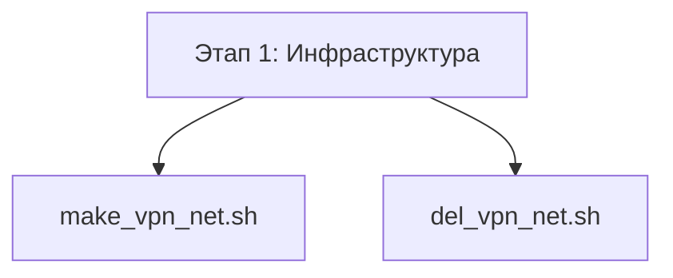
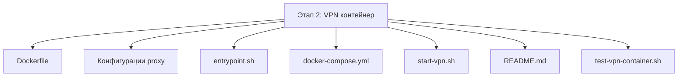
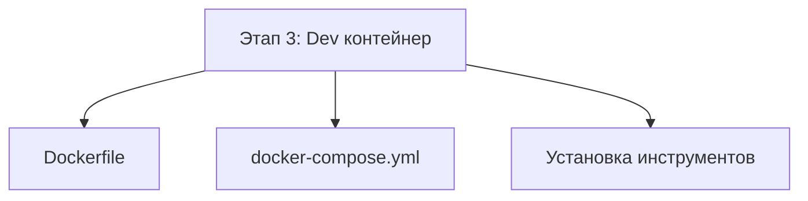
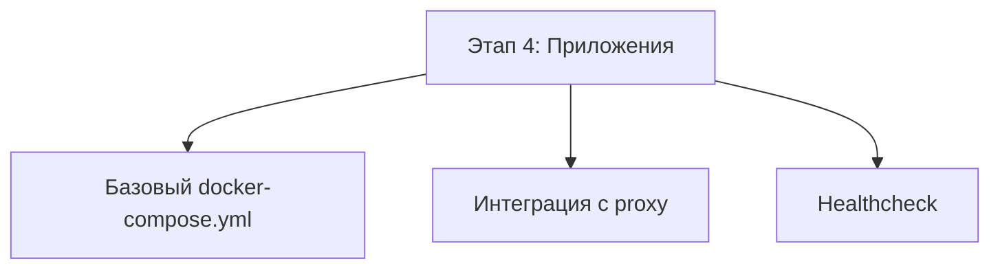
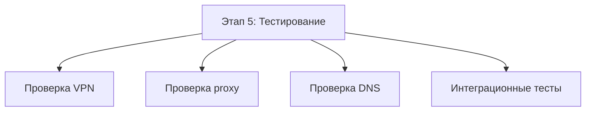
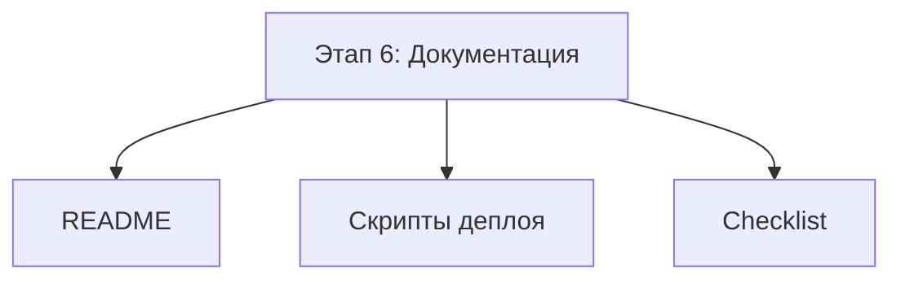

# Задачи для реализации архитектуры VPN + Dev Container + LLM proxy

## Статус реализации

| Этап | Статус | Примечания |
|------|--------|------------|
| Этап 1: Инфраструктура и сеть | ✅ **ЗАВЕРШЁН** | Скрипты создания/удаления сети созданы и протестированы |
| Этап 2: VPN контейнер | ✅ **ЗАВЕРШЁН** | Контейнер создан, скрипты запуска и тестирования готовы, README.md с инструкциями создан |
| Этап 3: Dev контейнер | ⏸️ Не начат | - |
| Этап 4: Приложения | ⏸️ Не начат | - |
| Этап 5: Тестирование и валидация | ⏸️ Не начат | - |
| Этап 6: Документация и деплой | ⏸️ Не начат | - |

---

## Этап 1: Инфраструктура и сеть ✅

**Статус:** ЗАВЕРШЁН

**Выполнено:**
- Создан [`scripts/make_vpn_net.sh`](../scripts/make_vpn_net.sh) — скрипт для создания Docker-сети `vpn-net`
- Создан [`scripts/del_vpn_net.sh`](../scripts/del_vpn_net.sh) — скрипт для удаления Docker-сети `vpn-net`
- Установлены права исполнения для скриптов
- Протестирована идемпотентность скриптов (повторные запуски не вызывают ошибок)
- Проверено создание и удаление сети `vpn-net`

**Использование:**
```bash
# Создать сеть
./vpn-utils/scripts/make_vpn_net.sh

# Удалить сеть
./vpn-utils/scripts/del_vpn_net.sh
```



### Задача 1.1: Создать скрипт make_vpn_net.sh ✅
Создать скрипт для создания внешней Docker-сети `vpn-net`

**Файл:** `scripts/make_vpn_net.sh`

```bash
#!/usr/bin/env bash
set -e

echo "[make_vpn_net.sh] Создание Docker сети vpn-net..."
docker network inspect vpn-net >/dev/null 2>&1 && {
  echo "[make_vpn_net.sh] Сеть vpn-net уже существует"
  exit 0
}

docker network create vpn-net
echo "[make_vpn_net.sh] Сеть vpn-net создана успешно"
```

### Задача 1.2: Создать скрипт del_vpn_net.sh ✅
Создать скрипт для удаления Docker-сети `vpn-net`

**Файл:** `scripts/del_vpn_net.sh`

```bash
#!/usr/bin/env bash
set -e

echo "[del_vpn_net.sh] Удаление Docker сети vpn-net..."
docker network inspect vpn-net >/dev/null 2>&1 || {
  echo "[del_vpn_net.sh] Сеть vpn-net не существует"
  exit 0
}

docker network rm vpn-net
echo "[del_vpn_net.sh] Сеть vpn-net удалена успешно"
```

---

## Этап 2: VPN контейнер ✅



**Статус:** ЗАВЕРШЁН

**Выполнено:**
- ✅ Создан [`vpn/Dockerfile`](../vpn/Dockerfile) — базовый образ ubuntu:22.04 с зависимостями
- ✅ Установлен adguardvpn-cli (v1.6.24) через скачивание архива с GitHub
- ✅ Создан [`vpn/danted.conf`](../vpn/danted.conf) — конфигурация SOCKS5 proxy
- ✅ Создан [`vpn/tinyproxy.conf`](../vpn/tinyproxy.conf) — конфигурация HTTP proxy
- ✅ Создан [`vpn/dnsmasq.conf`](../vpn/dnsmasq.conf) — конфигурация DNS резолвера
- ✅ Создан [`vpn/entrypoint.sh`](../vpn/entrypoint.sh) — нейтральный entrypoint (запускает bash)
- ✅ Создан [`vpn/start-vpn.sh`](../vpn/start-vpn.sh) — скрипт для ручного запуска VPN и прокси сервисов
- ✅ Создан [`vpn/docker-compose.yml`](../vpn/docker-compose.yml) — docker-compose конфигурация
- ✅ Создан [`vpn/README.md`](../vpn/README.md) — полная документация с инструкциями и mermaid диаграммами
- ✅ Создан [`scripts/test-vpn-container.sh`](../scripts/test-vpn-container.sh) — скрипт тестирования VPN контейнера
- ✅ Создана Docker сеть `vpn-net` с помощью скрипта [`make_vpn_net.sh`](../scripts/make_vpn_net.sh)
- ✅ Docker образ успешно собран

**Workflow работы с контейнером:**
1. Запуск контейнера: `cd vpn && docker compose up -d`
2. Подключение к контейнеру: `docker exec -it vpn bash`
3. Авторизация в VPN: `adguardvpn-cli login`
4. Подключение к локации: `adguardvpn-cli connect -l <location>`
5. Запуск прокси сервисов: `/usr/local/bin/start-vpn.sh`
6. Проверка работы: `./scripts/test-vpn-container.sh`

**Решённые проблемы:**
- ❌ ~~Установка adguardvpn-cli через официальный скрипт установки~~ → ✅ Решено: скачивание архива с GitHub
- ❌ ~~Интерактивные вопросы при установке~~ → ✅ Решено: ручная авторизация через `adguardvpn-cli login`
- ❌ ~~Контейнер постоянно перезапускается~~ → ✅ Решено: нейтральный entrypoint с `tail -f /dev/null &`

**Примечание:** Необоходимо продолжить Сборку, запуск и полное тестирование VPN контейнера. Все файлы созданы и готовы к использованию.

### Задача 2.1: Создать vpn/Dockerfile ✅
Создать Dockerfile для VPN контейнера

**Файл:** `vpn/Dockerfile`

**Требования:**
- Базовый образ: ubuntu:22.04
- Установить зависимости: ca-certificates, curl, iproute2, iputils-ping, procps, dnsmasq, tinyproxy, dante-server, sudo
- Скопировать конфигурационные файлы: danted.conf, tinyproxy.conf, dnsmasq.conf, entrypoint.sh
- Открыть порты: 1080 (SOCKS5), 1090 (HTTP)
- CMD: /usr/local/bin/entrypoint.sh

### Задача 2.2: Создать конфигурацию danted.conf
Создать конфигурацию для SOCKS5 proxy

**Файл:** `vpn/danted.conf`

**Требования:**
- Логирование в /var/log/danted.log
- Internal: 0.0.0.0 port = 1080
- External: tun0
- Method: none
- Правила доступа: разрешить все входящие и исходящие соединения

### Задача 2.3: Создать конфигурацию tinyproxy.conf
Создать конфигурацию для HTTP proxy

**Файл:** `vpn/tinyproxy.conf`

**Требования:**
- Port: 1090
- Timeout: 600
- User: nobody, Group: nogroup
- Allow: 127.0.0.1 и 0.0.0.0/0
- Listen: 0.0.0.0
- ConnectPort: 443, 563, 80
- Логирование в /var/log/tinyproxy/tinyproxy.log

### Задача 2.4: Создать конфигурацию dnsmasq.conf
Создать конфигурацию для локального DNS резолвера

**Файл:** `vpn/dnsmasq.conf`

**Требования:**
- no-resolv
- server=94.140.14.14 и 94.140.15.15 (AdGuard DNS)
- listen-address=127.0.0.1
- bind-interfaces
- cache-size=1000

### Задача 2.5: Создать entrypoint.sh
Создать скрипт запуска VPN контейнера

**Файл:** `vpn/entrypoint.sh`

**Требования:**
- Опциональный запуск adguardvpn-cli (если задан ADGUARDVPN_TOKEN)
- Запуск dnsmasq
- Ожидание появления tun0 (максимум 30 секунд)
- Запуск danted
- Запуск tinyproxy
- Вывод логов в stdout (tail -F)

### Задача 2.6: Создать vpn/docker-compose.yml
Создать docker-compose для VPN контейнера

**Файл:** `vpn/docker-compose.yml`

**Требования:**
- container_name: vpn
- cap_add: NET_ADMIN
- cap_drop: ALL
- devices: /dev/net/tun:/dev/net/tun
- restart: unless-stopped
- networks: vpn-net (external: true)
- volumes: конфигурационные файлы (read-only)

---

## Этап 3: Dev контейнер



### Задача 3.1: Создать dev/Dockerfile
Создать Dockerfile для dev контейнера

**Файл:** `dev/Dockerfile`

**Требования:**
- Базовый образ: ubuntu:22.04
- Установить: ca-certificates, curl, gnupg, git, build-essential, sudo, iproute2, procps
- Создать пользователя developer (UID 1000)
- WORKDIR: /home/developer/project
- CMD: /bin/bash

### Задача 3.2: Создать dev/docker-compose.yml
Создать docker-compose для dev контейнера

**Файл:** `dev/docker-compose.yml`

**Требования:**
- container_name: dev
- network_mode: "container:vpn"
- restart: unless-stopped
- volumes: dev-data (для home), ./project (для проекта)
- environment: HTTP_PROXY=http://127.0.0.1:1090, HTTPS_PROXY=http://127.0.0.1:1090, NO_PROXY=localhost,127.0.0.1

### Задача 3.3: Создать скрипт установки инструментов разработки
Создать скрипт для установки code-server и Kilo CLI

**Файл:** `dev/install-tools.sh`

**Требования:**
- Установка code-server через curl -fsSL https://code-server.dev/install.sh | sh
- Установка Kilo CLI через curl -fsSL https://get.kilo.sh | sh
- Настройка VS Code settings.json с http.proxy

---

## Этап 4: Приложения



### Задача 4.1: Создать шаблон apps/docker-compose.yml
Создать шаблон docker-compose для приложений

**Файл:** `apps/docker-compose.yml`

**Требования:**
- Подключение к vpn-net (external: true)
- environment: ALL_PROXY=socks5h://vpn:1080
- Пример сервиса app1 с ubuntu:22.04

### Задача 4.2: Создать модуль интеграции с proxy для Python
Создать модуль для работы с SOCKS5 proxy в Python

**Файл:** `apps/proxy_client.py`

**Требования:**
- Поддержка socks5h для requests/httpx
- Функция проверки доступности proxy
- Функция создания сессии с proxy

### Задача 4.3: Добавить healthcheck для приложений
Добавить healthcheck в docker-compose для проверки доступности proxy

**Требования:**
- Проверка доступности vpn:1080
- Fallback логика при недоступности proxy
- restart: unless-stopped

---

## Этап 5: Тестирование и валидация



### Задача 5.1: Создать скрипт проверки VPN-соединения
Создать скрипт для проверки работы VPN

**Файл:** `scripts/test-vpn.sh`

**Требования:**
- Проверка IP через api.ipify.org
- Проверка DNS резолвинга
- Сравнение с ожидаемым IP VPN

### Задача 5.2: Создать скрипт проверки proxy
Создать скрипт для проверки работы proxy

**Файл:** `scripts/test-proxy.sh`

**Требования:**
- Тест SOCKS5 proxy (порт 1080)
- Тест HTTP proxy (порт 1090)
- Проверка DNS резолвинга через proxy

### Задача 5.3: Создать интеграционные тесты
Создать тесты для проверки интеграции компонентов

**Файл:** `tests/integration_test.py`

**Требования:**
- Проверка LLM-вызовов через proxy
- Проверка работы VS Code extension
- Проверка работы Kilo CLI
- Проверка работы приложений

---

## Этап 6: Документация и деплой



### Задача 6.1: Создать README с инструкциями
Создать основной README проекта

**Файл:** `README.md`

**Требования:**
- Quickstart guide
- Architecture overview
- Troubleshooting guide
- Production checklist

### Задача 6.2: Создать скрипты деплоя
Создать скрипты для автоматизации деплоя

**Файлы:**
- `scripts/initial-setup.sh` — начальная настройка
- `scripts/deploy.sh` — деплой всех сервисов
- `scripts/monitoring-setup.sh` — настройка мониторинга

### Задача 6.3: Создать production checklist
Создать чеклист для production

**Файл:** `docs/production-checklist.md`

**Требования:**
- Проверка безопасности
- Проверка мониторинга
- Проверка резервного копирования
- Проверка логирования

---

## Приоритизация задач

| Приоритет | Задачи | Описание |
|-----------|--------|----------|
| **P0** | ~~1.1, 1.2~~, 2.1-2.6, 3.1-3.2 | Базовая инфраструктура и VPN |
| **P1** | 4.1-4.2, 5.1-5.2 | Интеграция приложений и базовое тестирование |
| **P2** | 3.3, 4.3, 5.3 | Дополнительные инструменты и интеграционные тесты |
| **P3** | 6.1-6.3 | Документация и деплой |

**Примечание:** ~~зачёркнутые~~ задачи выполнены.

---

## Временная оценка

| Этап | Оценка времени | Статус |
|------|----------------|--------|
| Этап 1: Инфраструктура | 30 минут | ✅ Завершён |
| Этап 2: VPN контейнер | 3-4 часа | ✅ Завершён |
| Этап 3: Dev контейнер | 2-3 часа | ⏸️ Не начат |
| Этап 4: Приложения | 2-3 часа | ⏸️ Не начат |
| Этап 5: Тестирование | 2-3 часа | ⏸️ Не начат |
| Этап 6: Документация | 2-3 часа | ⏸️ Не начат |
| **Итого** | **11.5-16.5 часов** | **~3.5/16.5 завершено** |

---

## Порядок выполнения

1. ~~**Этап 1 (P0):** Создать скрипты управления сетью~~ ✅
2. **Этап 2 (P0):** Создать и протестировать VPN контейнер ← **СЛЕДУЮЩИЙ**
3. **Этап 3 (P0):** Создать и протестировать dev контейнер
4. **Этап 4 (P1):** Создать шаблон для приложений
5. **Этап 5 (P1):** Создать скрипты тестирования
6. **Этап 6 (P3):** Документация и скрипты деплоя

---

## Заметки

- Скрипт `make all-up` будет создан на финальном этапе после полного тестирования всех компонентов
- Все скрипты должны быть исполняемыми (`chmod +x`)
- Логирование должно быть структурированным для удобства отладки
- Все конфигурационные файлы должны быть параметризованы через переменные окружения
