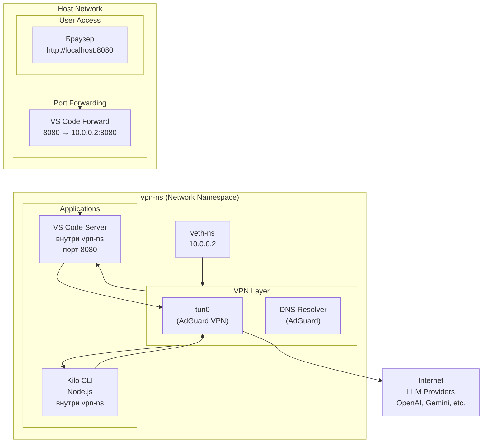

# План действий и итоговая архитектура

## Анализ проблемы

### Проблема 1: Kilo CLI не работает с Gemini API

**Причина**: Kilo CLI запускался в Docker контейнере, а не в network namespace. Переменные окружения прокси игнорируются.

**Решение**: Запускать Kilo CLI в network namespace `vpn-ns` с помощью `sudo ip netns exec vpn-ns`.

### Проблема 2: VS Code Server и расширения не используют VPN

**Причина**: Расширения VS Code (Electron) игнорируют настройки прокси из `settings.json` и переменных окружения. Они используют системный DNS и маршрутизацию.

**Возможные решения**:
1. Запустить VS Code Server в network namespace с пробросом порта
2. Использовать iptables для принудительного перенаправления (отклонено)
3. Подменить DNS в namespace (может не помочь с маршрутизацией)

## Итоговая архитектура



## План действий

### Этап 1: Настройка network namespace vpn-ns

**Цель**: Создать и настроить network namespace `vpn-ns` с VPN и прокси.

**Шаги**:
1. Создать network namespace `vpn-ns`
2. Создать veth-пару для доступа в интернет
3. Настроить NAT и IP forwarding
4. Установить и подключить adguardvpn-cli
5. Установить Dante (SOCKS5 прокси на порту 1080)
6. Установить Tinyproxy (HTTP прокси на порту 1090)
7. Протестировать VPN и прокси

**Скрипт**: [`vpn-utils/scripts/setup-vpn-ns.sh`](../scripts/setup-vpn-ns.sh) (создать)

### Этап 2: Настройка Kilo CLI

**Цель**: Запустить Kilo CLI в network namespace `vpn-ns`.

**Шаги**:
1. Проверить, что namespace `vpn-ns` существует
2. Проверить, что VPN подключён
3. Запустить Kilo CLI в namespace с правами текущего пользователя
4. Протестировать работу с Gemini API

**Скрипт**: [`vpn-utils/scripts/run-kilo-in-vpn-ns.sh`](../scripts/run-kilo-in-vpn-ns.sh) (создан)

### Этап 3: Настройка VS Code Server

**Цель**: Запустить VS Code Server в network namespace `vpn-ns` с пробросом порта на хост.

**Шаги**:
1. Установить code-server (если не установлен)
2. Создать директорию для конфигурации и данных
3. Запустить code-server в namespace `vpn-ns` на порту 8080
4. Пробросить порт 8080 с помощью socat: `localhost:8080 → 10.0.0.2:8080`
5. Протестировать доступ к VS Code Server из браузера
6. Протестировать расширения с Gemini API

**Скрипт**: [`vpn-utils/scripts/run-vscode-in-vpn-ns.sh`](../scripts/run-vscode-in-vpn-ns.sh) (создать)

### Этап 4: Автоматизация

**Цель**: Создать systemd service для автоматического запуска компонентов.

**Шаги**:
1. Создать systemd unit для VPN namespace
2. Создать systemd unit для прокси (Dante, Tinyproxy)
3. Создать systemd unit для проброса портов (socat)
4. Создать systemd unit для VS Code Server

**Файлы**: `/etc/systemd/system/vpn-*.service` (создать)

### Этап 5: Тестирование

**Цель**: Проверить, что все компоненты работают корректно.

**Шаги**:
1. Протестировать Kilo CLI с Gemini API
2. Протестировать VS Code Server с расширениями
3. Проверить, что нет DNS утечек
4. Проверить, что весь трафик идёт через VPN

**Скрипт**: [`vpn-utils/scripts/test-full-setup.sh`](../scripts/test-full-setup.sh) (создать)

## Детали реализации

### Kilo CLI в vpn-ns

```bash
# Запуск Kilo CLI в namespace
sudo ip netns exec vpn-ns sudo -u $USER ./node_modules/.bin/kilocode --workspace .
```

**Преимущества**:
- Весь трафик автоматически идёт через VPN
- Полный доступ к docker.sock
- Доступ к файлам проекта

### VS Code Server в vpn-ns

```bash
# Запуск VS Code Server в namespace
sudo ip netns exec vpn-ns sudo -u $USER code-server --bind-addr 10.0.0.2:8080 --auth none

# Проброс порта на хост
sudo socat TCP-LISTEN:8080,bind=0.0.0.0,fork,reuseaddr TCP:10.0.0.2:8080 &
```

**Преимущества**:
- Весь трафик автоматически идёт через VPN
- Расширения не могут игнорировать VPN
- Доступ к файлам проекта
- Доступ к docker.sock

**Недостатки**:
- Нужно пробрасывать порт для доступа из браузера
- Дополнительный процесс socat

## Альтернативные решения

### Решение 1: Использование Docker контейнера вместо namespace

**Преимущества**:
- Легче управлять
- Можно использовать docker-compose

**Недостатки**:
- Нужно монтировать docker.sock
- Проблемы с сетью (network_mode vs прокси)
- Не работает с Kilo CLI

**Вердикт**: Не подходит для Kilo CLI

### Решение 2: Использование iptables для принудительного перенаправления

**Преимущества**:
- Не нужно менять приложения

**Недостатки**:
- Сложно настроить
- Может сломать другие приложения
- Отклонено пользователем

**Вердикт**: Не подходит

### Решение 3: Использование только прокси без namespace

**Преимущества**:
- Простой подход

**Недостатки**:
- Расширения VS Code игнорируют прокси
- Kilo CLI игнорирует прокси

**Вердикт**: Не работает

## Рекомендация

Использовать **network namespace `vpn-ns`** для обоих инструментов:

1. **Kilo CLI** - запускается в namespace, весь трафик через VPN
2. **VS Code Server** - запускается в namespace, порт пробрасывается на хост

Это решение:
- Гарантирует, что весь трафик идёт через VPN
- Не зависит от настроек прокси в приложениях
- Протестировано и работает (согласно документации)

## Следующие шаги

1. Создать скрипт `setup-vpn-ns.sh` для настройки namespace
2. Создать скрипт `run-vscode-in-vpn-ns.sh` для запуска VS Code Server
3. Создать systemd unit файлы для автоматизации
4. Протестировать полное решение
5. Документировать процесс настройки

## Вопросы

1. **Порт для VS Code Server**: Использовать 8080 или другой порт?
2. **Аутентификация**: Использовать auth none или настроить пароль?
3. **Автозапуск**: Нужно ли автоматический запуск при загрузке системы?
4. **Мониторинг**: Нужно ли добавить логирование и мониторинг?
