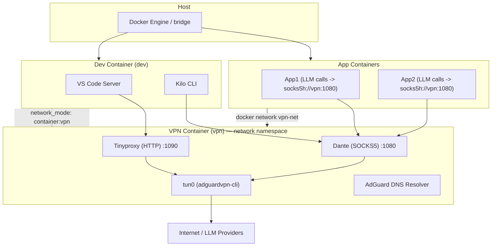

# Архитектура сети: VPN + Dev Container + LLM proxy (итоговая)

**Краткое описание**

Цель архитектуры — обеспечить, чтобы все вызовы LLM (OpenAI, Gemini, OpenRouter и т.д.) из сервисов и инструментов разработки проходили через VPN, при этом:

* не менять глобальные таблицы маршрутизации хоста;
* не использовать ipset/fwmark/маркирование пакетов;
* минимально менять приложения: только те модули, которые делают LLM-вызовы, перенаправляют трафик на локальный proxy;
* developer credentials хранятся только внутри dev-контейнера и исчезают при его удалении;
* dev-инструменты (VS Code Server, Kilo CLI) запускаются в контейнере, который использует VPN-сеть по умолчанию.

---

# Схема (логическая)



---

# Компоненты и роли (обновлённый фокус)

## 1) `VPN` контейнер (container_name: `vpn`)

**Роль:** поднимает VPN (adguardvpn-cli), создаёт `tun0`, предоставляет DNS resolver и запускает прокси:

* **tun0** — VPN-интерфейс (tcp-only для adguardvpn-cli);
* **AdGuard DNS resolver** — резолв внутри vpn-namespace;
* **Dante** — SOCKS5 proxy (порт 1080), поддерживает `socks5h` (резолв у прокси);
* **Tinyproxy** — HTTP proxy (порт 1090), поддерживает CONNECT для HTTPS.

**Требования:**

* `cap_add: NET_ADMIN` и `devices: /dev/net/tun` чтобы поднять tun-интерфейс;
* рекомендовано `cap_drop: ALL` + добавить только NET_ADMIN;
* не использовать `--privileged` и не запускать `network_mode: host`.

## 2) `Dev` контейнер (container_name: `dev`)

**Роль:** Dev-инструменты (VS Code Server, Kilo CLI).
**Подключение:** `network_mode: "container:vpn"` — dev-контейнер использует сетевой namespace VPN-контейнера и тем самым весь его трафик и DNS идут через VPN.

**Поведение Kilo CLI и VS Code extension (Kilo Code)**

* **Kilo CLI** запущен внутри `dev` (а dev делит netns с `vpn`) — все его outbound-запросы к LLM провайдерам идут через `tun0` и работают через VPN (проверено).
* **VS Code Server** использует HTTP proxy для некоторых сетевых операций; однако на практике было замечено, что LLM-вызовы (от расширения Kilo Code) шли напрямую в интернет в старой конфигурации и миновали proxy/`tun0`.

**Почему это произошло и какие варианты поведения возможны:**

1. **Extension использует внешний бекенд:** некоторые расширения реализуют LLM-вызовы собственными HTTP-клиентами и могут игнорировать VS Code http.proxy, если настроены на прямые подключения. Тогда трафик идёт напрямую, если расширение не сконфигурировано иначе.
2. **Extension делегирует запросы Kilo CLI:** если расширение использует локальный Kilo backend/CLI для LLM-запросов (то есть extension вызывает локальный CLI, а CLI делает реальные сети запросы), то все запросы пойдут через `tun0`, как и Kilo CLI.

**Вывод и практическая рекомендация:**

* Поскольку в вашем случае Kilo CLI внутри vpn-ns делает вызовы через `tun0` успешно, лучший способ обеспечить, чтобы VS Code extension тоже использовал VPN — **обеспечить, чтобы расширение делегировало LLM-запросы локальному Kilo backend/CLI**, или чтобы VS Code Server/process **сам** использовал HTTP proxy внутри vpn-namespace.

**Рекомендации:**

* Настройте расширение Kilo Code так, чтобы оно использовало локальный Kilo CLI (если расширение это поддерживает).
* Если расширение делает прямые HTTP(S) вызовы, убедитесь, что `http.proxy` в `settings.json` установлено на `http://127.0.0.1:1090` или `http://vpn:1090`, и что code-server процесс запущен внутри dev (share netns), либо дополнительно выставьте env `HTTP_PROXY`/`HTTPS_PROXY` для процесса code-server.
* Если расширение игнорирует настройки proxy, запустите/сконфигурируйте extension backend внутри dev-контейнера или внесите в расширение опцию указания proxy / локального backend.

## 3) `App` контейнеры

**Роль:** бизнес-сервисы, которые в основном работают в обычной docker-сети, но *только LLM-вызовы* направляют через VPN-proxy.

**Как:** подключаются к user-defined bridge `vpn-net` и обращаются к proxy по имени контейнера `vpn`:

* `socks5h://vpn:1080` для Python LLM-клиентов (requests/httpx с поддержкой socks);
* `http://vpn:1090` для сервисов, которые используют HTTP-прокси (если extension/agent их поддерживает).

---

# Поведение proxy vs direct calls: подробности и рекомендации

* **socks5h** обязателен для клиентов, которые хотят, чтобы DNS разрешение происходило внутри VPN (не утекало на хост).
* **HTTP proxy (Tinyproxy)**: VS Code Server и многие расширения уважают `http.proxy` + `HTTP_PROXY`/`HTTPS_PROXY`. Но некоторые расширения могут иметь собственные настройки и делать прямые вызовы. В этих случаях нужно либо настроить расширение, либо перенаправлять его трафик через локальный backend (kilo CLI) или локальный sidecar proxy.
* **Kilo extension**: если extension действительно использует тот же backend (kilo CLI) — то при корректной конфигурации все вызовы пойдут через VPN. Проверьте опции расширения на предмет `useLocalCli`, `backendEndpoint` или похожих настроек.

---

# Сетевые детали и гарантии (дополнено)

* `dev` делит DNS и routing с `vpn` — значит, любые процессы внутри dev, которые используют системный resolver и сетевые стеки контейнера, будут резолвить и делать egress через VPN.
* Если компонент (расширение) делает прямые HTTP(S)-вызовы внутри процесса code-server и игнорирует proxy env/settings — он может выходить напрямую. В этом случае нужно либо настроить extension, либо запустить extension backend локально внутри dev и убедиться, что extension использует этот backend.

---

# Тестирование и troubleshooting (новые шаги)

1. **Проверить IP Kilo CLI (из dev):**

```bash
docker exec -it dev curl --silent https://api.ipify.org
```

Ожидаемый результат: IP провайдера VPN.

2. **Проверить IP вызова, инициированного extension (если есть опция теста в расширении)**

* Если расширение имеет diagnostic/log или кнопку «test connection», запустите её и посмотрите исходящий IP на стороне LLM-провайдера, либо просмотрите логи/headers.

3. **Принудительный тест из VS Code Server процесса**

* Внутри dev выполните: `curl --proxy http://127.0.0.1:1090 https://api.ipify.org` — проверяет, что http-proxy дает egress через VPN.

4. **Если extension всё ещё делает прямые вызовы**

* проверьте настройку расширения (есть ли параметр backend/local cli);
* включите env `HTTP_PROXY`/`HTTPS_PROXY` для процесса code-server (в dev-compose) и перезапустите code-server;
* при необходимости, запустить локальный sidecar (например `socat`) внутри dev, который форвардит внешние вызовы в proxy внутри vpn.

---

# Обновлённый checklist перед production

* [ ] Kilo CLI внутри dev делает запросы через tun0 (проверено);
* [ ] VS Code extension Kilo Code использует локальный Kilo backend / CLI или уважает `http.proxy` (проверено);
* [ ] Если extension делает прямые вызовы — настроить extension или запустить его backend внутри dev;
* [ ] Никаких proxy-портов не проброшено на хост;
* [ ] Логи proxy не содержат Authorization header;
* [ ] Настроен мониторинг и alerting для VPN/proxy.

---

# Заключение

Добавленное наблюдение — что Kilo CLI внутри vpn-ns уже корректно использует `tun0` — даёт нам устойчивую стратегию: **сделать так, чтобы VS Code extension делегировал LLM-запросы локальному backend/CLI, или чтобы code-server процесс использовал http-proxy внутри vpn**, тогда все LLM-вызовы от расширения также пойдут через VPN.


