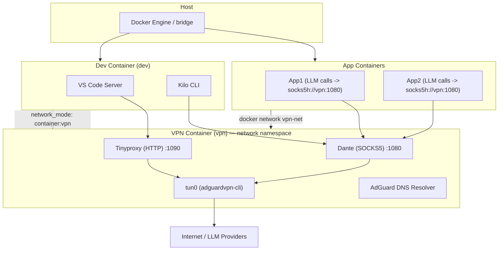

# Архитектура сети: VPN + Dev Container + LLM proxy

## Краткое описание

Цель архитектуры — обеспечить, чтобы все вызовы LLM (OpenAI, Gemini, OpenRouter и т.д.) из сервисов и инструментов разработки проходили через VPN, при этом:

* не менять глобальные таблицы маршрутизации хоста;
* не использовать ipset/fwmark/маркирование пакетов;
* минимально менять приложения: только те модули, которые делают LLM-вызовы, перенаправляют трафик на локальный proxy;
* developer credentials хранятся только внутри dev-контейнера и исчезают при его удалении;
* dev-инструменты (VS Code Server, Kilo CLI) запускаются в контейнере, который использует VPN-сеть по умолчанию;
* контейнеры управляются через независимые docker-compose файлы для максимальной гибкости.

---

## Логическая схема



---

## Компоненты и роли

### 1) VPN контейнер (container_name: `vpn`)

**Роль:** поднимает VPN (adguardvpn-cli), создаёт `tun0`, предоставляет DNS resolver и запускает прокси:

* **tun0** — VPN-интерфейс (tcp-only для adguardvpn-cli);
* **AdGuard DNS resolver** — резолв внутри vpn-namespace;
* **Dante** — SOCKS5 proxy (порт 1080), поддерживает `socks5h` (резолв у прокси);
* **Tinyproxy** — HTTP proxy (порт 1090), поддерживает CONNECT для HTTPS.

**Требования:**

* `cap_add: NET_ADMIN` и `devices: /dev/net/tun` чтобы поднять tun-интерфейс;
* рекомендовано `cap_drop: ALL` + добавить только NET_ADMIN;
* не использовать `--privileged` и не запускать `network_mode: host`.

---

### 2) Dev контейнер (container_name: `dev`)

**Роль:** Dev-инструменты (VS Code Server, Kilo CLI).
**Подключение:** `network_mode: "container:vpn"` — dev-контейнер использует сетевой namespace VPN-контейнера и тем самым весь его трафик и DNS идут через VPN.

**Поведение Kilo CLI и VS Code extension (Kilo Code)**

* **Kilo CLI** запущен внутри `dev` (а dev делит netns с `vpn`) — все его outbound-запросы к LLM провайдерам идут через `tun0` и работают через VPN (проверено).
* **VS Code Server** использует HTTP proxy для некоторых сетевых операций; однако на практике было замечено, что LLM-вызовы (от расширения Kilo Code) шли напрямую в интернет в старой конфигурации и миновали proxy/`tun0`.

**Почему это произошло и какие варианты поведения возможны:**

1. **Extension использует внешний бекенд:** некоторые расширения реализуют LLM-вызовы собственными HTTP-клиентами и могут игнорировать VS Code http.proxy, если настроены на прямые подключения. Тогда трафик идёт напрямую, если расширение не сконфигурировано иначе.
2. **Extension делегирует запросы Kilo CLI:** если расширение использует локальный Kilo backend/CLI для LLM-запросов (то есть extension вызывает локальный CLI, а CLI делает реальные сети запросы), то все запросы пойдут через `tun0`, как и Kilo CLI.

**Вывод и практическая рекомендация:**

* Поскольку в вашем случае Kilo CLI внутри vpn-ns делает вызовы через `tun0` успешно, лучший способ обеспечить, чтобы VS Code extension тоже использовал VPN — **обеспечить, чтобы расширение делегировало LLM-запросы локальному Kilo backend/CLI**, или чтобы VS Code Server/process **сам** использовал HTTP proxy внутри vpn-namespace.

**Рекомендации:**

* Настройте расширение Kilo Code так, чтобы оно использовало локальный Kilo CLI (если расширение это поддерживает).
* Если расширение делает прямые HTTP(S) вызовы, убедитесь, что `http.proxy` в `settings.json` установлено на `http://127.0.0.1:1090` или `http://vpn:1090`, и что code-server процесс запущен внутри dev (share netns), либо дополнительно выставьте env `HTTP_PROXY`/`HTTPS_PROXY` для процесса code-server.
* Если расширение игнорирует настройки proxy, запустите/сконфигурируйте extension backend внутри dev-контейнера или внесите в расширение опцию указания proxy / локального backend.

---

### 3) App контейнеры

**Роль:** бизнес-сервисы, которые в основном работают в обычной docker-сети, но *только LLM-вызовы* направляют через VPN-proxy.

**Как:** подключаются к user-defined bridge `vpn-net` и обращаются к proxy по имени контейнера `vpn`:

* `socks5h://vpn:1080` для Python LLM-клиентов (requests/httpx с поддержкой socks);
* `http://vpn:1090` для сервисов, которые используют HTTP-прокси (если extension/agent их поддерживают).

---

## Поведение proxy vs direct calls: подробности и рекомендации

* **socks5h** обязателен для клиентов, которые хотят, чтобы DNS разрешение происходило внутри VPN (не утекало на хост).
* **HTTP proxy (Tinyproxy)**: VS Code Server и многие расширения уважают `http.proxy` + `HTTP_PROXY`/`HTTPS_PROXY`. Но некоторые расширения могут иметь собственные настройки и делать прямые вызовы. В этих случаях нужно либо настроить расширение, либо перенаправлять его трафик через локальный backend (kilo CLI) или локальный sidecar proxy.
* **Kilo extension**: если extension действительно использует тот же backend (kilo CLI) — то при корректной конфигурации все вызовы пойдут через VPN. Проверьте опции расширения на предмет `useLocalCli`, `backendEndpoint` или похожих настроек.

---

## Сетевые детали и гарантии

* `dev` делит DNS и routing с `vpn` — значит, любые процессы внутри dev, которые используют системный resolver и сетевые стеки контейнера, будут резолвить и делать egress через VPN.
* Если компонент (расширение) делает прямые HTTP(S)-вызовы внутри процесса code-server и игнорирует proxy env/settings — он может выходить напрямую. В этом случае нужно либо настроить extension, либо запустить extension backend локально внутри dev и убедиться, что extension использует этот backend.

---

## Docker network и независимые compose

### Короткие ответы

* Да — приложения **могут** запускаться из своего `docker-compose`, если сетевое пространство (docker network) уже существует.
* **Если сеть отсутствует** и в `docker-compose.yml` она объявлена как `external: true`, то `docker compose up` упадёт с ошибкой.
* **Если сеть есть**, но `vpn`-контейнер не запущен — сеть просто будет «пустой» (обычный bridge). App-контейнеры смогут обмениваться между собой, но имя `vpn` в Docker-DNS **не будет резолвиться** в IP (т.е. `socks5h://vpn:1080` — не заработает).
* Наличие сети **не создаёт VPN-интерфейс tun0** и не направляет трафик в VPN автоматически — tun0 живёт внутри vpn-контейнера. Пока vpn не запущен, «vpn-сеть» — это просто сеть Docker и трафик контейнеров уходит наружу по обычному NAT хоста.

---

### Детали: как это работает и почему

1. **Docker network vs VPN внутри контейнера**

   * Docker network — это логический мост (bridge) управляемый Docker daemon. Она существует независимо от того, есть ли внутри неё какие-то контейнеры.
   * VPN (tun0) — это интерфейс, поднятый *внутри* vpn-контейнера. Он не «впиливается» в Docker network. Вместо этого прокси внутри vpn-контейнера (dante/tinyproxy) слушает на IP контейнера в Docker network и делает egress через tun0.

2. **Когда app запускается и сеть есть, но vpn не запущен**

   * App подключается к сети `vpn-net` → это удачно.
   * `docker` DNS выдаёт имена только для **работающих** контейнеров на этой сети. Если контейнера `vpn` нет — имя `vpn` не резолвится.
   * Если в конфиге приложений жёстко указан `socks5h://vpn:1080`, попытки подключения будут падать (Connection refused / name not found). Они не переключатся автоматически на «обычный интернет», если приложение не умеет fallback.
   * Если же приложение настроено **не через proxy**, а напрямую, его egress пойдёт через Docker NAT на хост и далее в интернет (обычный хостовый интернет).

3. **Если vpn запущен после того, как запустились приложения**

   * После запуска контейнера `vpn` — он будет присоединён к `vpn-net`, получит IP, Docker DNS начнёт резолвить `vpn` → тогда `socks5h://vpn:1080` станет доступен и приложения смогут установить соединение (если они повторно делают попытки). Некоторые клиенты открывают одно соединение при старте и не пересоздают его автоматически — в этом случае нужен restart приложения или логика reconnection.

---

### Может ли контейнер создать docker network?

**Короткий ответ: ❌ нет, и это принципиально**

**Почему?**

Docker network:

* создаётся и управляется **Docker daemon**
* **НЕ контейнерами**
* контейнер **не имеет доступа** к Docker API (если вы специально не пробросили `/var/run/docker.sock`, что небезопасно)

❗ Контейнер не может:

* создать bridge-сеть
* управлять правами docker network
* менять docker-level маршрутизацию

📌 **Даже `--cap-add NET_ADMIN` не помогает** — это только для *внутреннего* netns контейнера.

---

### Правильный паттерн: `external: true` + bootstrap compose

#### Шаг 0 — создать сеть **один раз**

```bash
docker network create vpn-net
```

(делается руками или скриптом)

---

## Практическая реализация

### Структура файлов

```
./vpn/
  Dockerfile
  entrypoint.sh
  danted.conf
  tinyproxy.conf
  dnsmasq.conf
  docker-compose.yml
./dev/
  Dockerfile
  docker-compose.yml
./apps/
  docker-compose.yml
./scripts/
  bootstrap.sh
```

---

### vpn/Dockerfile

```Dockerfile
FROM ubuntu:22.04

ENV DEBIAN_FRONTEND=noninteractive

RUN apt-get update \
 && apt-get install -y --no-install-recommends \
    ca-certificates curl iproute2 iputils-ping procps \
    dnsmasq tinyproxy dante-server sudo \
 && rm -rf /var/lib/apt/lists/*

# Конфиги и скрипт
COPY danted.conf /etc/danted.conf
COPY tinyproxy.conf /etc/tinyproxy/tinyproxy.conf
COPY dnsmasq.conf /etc/dnsmasq.conf
COPY entrypoint.sh /usr/local/bin/entrypoint.sh
RUN chmod +x /usr/local/bin/entrypoint.sh

EXPOSE 1080 1090

# Не пробрасываем порты наружу на хост — они нужны для связи внутри docker-сети
CMD ["/usr/local/bin/entrypoint.sh"]
```

---

### vpn/danted.conf (шаблон)

```text
# Dante SOCKS server config (dante-server)
logoutput: /var/log/danted.log
internal: 0.0.0.0 port = 1080
external: tun0
method: none
user.privileged: root
user.notprivileged: nobody

client pass {
  from: 0.0.0.0/0 to: 0.0.0.0/0
}

socks pass {
  from: 0.0.0.0/0 to: 0.0.0.0/0
}
```

> Примечание: `external: tun0` гарантирует, что выходящий трафик dante будет идти через VPN-интерфейс. Если tun0 ещё не поднят на момент старта, entrypoint.sh ждёт интерфейс.

---

### vpn/tinyproxy.conf (шаблон)

```text
User nobody
Group nogroup
Port 1090
Timeout 600
DefaultErrorFile "/usr/share/tinyproxy/default.html"
StatFile "/usr/share/tinyproxy/stats.html"
Logfile "/var/log/tinyproxy/tinyproxy.log"
LogLevel Notice
PidFile "/var/run/tinyproxy.pid"
MaxClients 100
MinSpareServers 5
MaxSpareServers 20
StartServers 10

# allow local docker networks (по умолчанию разрешаем все внутренние запросы)
Allow 127.0.0.1
Allow 0.0.0.0/0

# Прослушивать на всех интерфейсах внутри контейнера — dev (network_mode: container:vpn) и другие контейнеры подключённые к vpn-net смогут обращаться по имени 'vpn:1090'
Listen 0.0.0.0

# Разрешаем CONNECT (HTTPS)
ConnectPort 443
ConnectPort 563
ConnectPort 80
```

---

### vpn/dnsmasq.conf (шаблон — используем публичные AdGuard DNS сервера)

```text
# dnsmasq простая конфигурация для локального резолвера
no-resolv
server=94.140.14.14
server=94.140.15.15
listen-address=127.0.0.1
bind-interfaces
cache-size=1000
```

> Если у вас есть свой AdGuard DNS/AdGuard VPN клиент — можно изменить server= на локальный адрес.

---

### vpn/entrypoint.sh

```bash
#!/bin/bash
set -e

# Лог в stdout
mkdir -p /var/log

# 1) Опционально: запустить VPN-клиент (adguardvpn-cli или любой другой)
# Если вы используете adguardvpn-cli и передаёте токен через ADGUARDVPN_TOKEN, попытка соединения будет предпринята.
# Пример: docker compose run -e ADGUARDVPN_TOKEN=... vpn

if [ -n "${ADGUARDVPN_TOKEN:-}" ]; then
  echo "[entrypoint] ADGUARDVPN_TOKEN задан — пытаемся запустить adguardvpn-cli"
  if command -v adguardvpn-cli >/dev/null 2>&1; then
    adguardvpn-cli login --token "$ADGUARDVPN_TOKEN" || true
    adguardvpn-cli connect --tcp || true
  else
    echo "[entrypoint] adguardvpn-cli не установлен в контейнере. Пропускаем запуск VPN-клиента."
  fi
fi

# 2) Запускаем dnsmasq (локальный резолвер) — обеспечивает резолв внутри vpn-namespace
if [ -f /etc/dnsmasq.conf ]; then
  echo "[entrypoint] старт dnsmasq"
  pkill dnsmasq || true
  dnsmasq --conf-file=/etc/dnsmasq.conf || true
fi

# 3) Ждём появления tun0 (если ожидается VPN-интерфейс)
# Ждём максимум 30s — если нет tun0, продолжим, но danted external может быть некорректен
for i in {1..30}; do
  if ip link show tun0 >/dev/null 2>&1; then
    echo "[entrypoint] интерфейс tun0 найден"
    break
  fi
  echo "[entrypoint] ждём tun0... ($i/30)"
  sleep 1
done

# 4) Запускаем danted (socks5)
if [ -f /etc/danted.conf ]; then
  echo "[entrypoint] старт danted"
  pkill danted || true
  /usr/sbin/danted -f /etc/danted.conf &
fi

# 5) Запускаем tinyproxy (http)
if [ -f /etc/tinyproxy/tinyproxy.conf ]; then
  echo "[entrypoint] старт tinyproxy"
  pkill tinyproxy || true
  tinyproxy -c /etc/tinyproxy/tinyproxy.conf &
fi

# 6) Вывод логов в foreground (простейший способ держать контейнер живым)
# Выводим основные логи в stdout для удобства
sleep 1

# tail логов по всем возможным файлам
mkdir -p /var/log/tinyproxy /var/log
# Не все файлы могут существовать сразу — используем tail -F
tail -F /var/log/danted.log /var/log/tinyproxy/tinyproxy.log || true

# Если tail завершится — контейнер тоже завершится
```

---

### vpn/docker-compose.yml

```yaml
version: "3.8"

services:
  vpn:
    container_name: vpn
    build: .
    cap_add:
      - NET_ADMIN
    cap_drop:
      - ALL
    devices:
      - /dev/net/tun:/dev/net/tun
    restart: unless-stopped
    networks:
      - vpn-net
    volumes:
      - ./danted.conf:/etc/danted.conf:ro
      - ./tinyproxy.conf:/etc/tinyproxy/tinyproxy.conf:ro
      - ./dnsmasq.conf:/etc/dnsmasq.conf:ro

networks:
  vpn-net:
    external: true
```

🔑 **Важно**

* compose **НЕ создаёт сеть**
* он ожидает, что `vpn-net` уже существует
* vpn может быть перезапущен независимо

---

### dev/Dockerfile

```Dockerfile
FROM ubuntu:22.04
ENV DEBIAN_FRONTEND=noninteractive

RUN apt-get update \
 && apt-get install -y --no-install-recommends \
    ca-certificates curl gnupg git build-essential sudo iproute2 procps \
 && rm -rf /var/lib/apt/lists/*

# Папка рабочего проекта (примеры)
ARG USER=developer
ARG UID=1000
RUN useradd -m -u ${UID} -s /bin/bash ${USER} && echo "${USER} ALL=(ALL) NOPASSWD:ALL" > /etc/sudoers.d/${USER}
USER ${USER}
WORKDIR /home/${USER}/project

# --- Рекомендации по установке code-server и Kilo CLI ---
# Мы не ставим code-server и kilo в образ автоматически — разные проекты требуют разной версии и token'ов.
# Ниже — команды, которые можно выполнить внутри контейнера (или добавить в Dockerfile при желании):
#
# 1) Установить code-server (пример):
#   curl -fsSL https://code-server.dev/install.sh | sh
#
# 2) Установить Kilo CLI (пример):
#   curl -fsSL https://get.kilo.sh | sh
#
# 3) Настроить HTTP_PROXY/HTTPS_PROXY (если нужно), см. docker-compose — dev будет share net namespace с vpn.

CMD ["/bin/bash"]
```

---

### dev/docker-compose.yml

```yaml
version: "3.8"

services:
  dev:
    container_name: dev
    build: .
    network_mode: "container:vpn"
    restart: unless-stopped
    volumes:
      - dev-data:/home/developer
      - ./project:/home/developer/project
    environment:
      - HTTP_PROXY=http://127.0.0.1:1090
      - HTTPS_PROXY=http://127.0.0.1:1090
      - NO_PROXY=localhost,127.0.0.1

volumes:
  dev-data:
```

**Что это даёт**

* dev **НЕ зависит от compose vpn**
* но **зависит от факта существования контейнера `vpn`**
* `docker compose up dev` упадёт, если `vpn` не запущен — и это **правильное поведение**

---

### apps/docker-compose.yml

```yaml
version: "3.8"

services:
  app1:
    image: ubuntu:22.04
    command: sleep infinity
    networks:
      - vpn-net
    environment:
      - ALL_PROXY=socks5h://vpn:1080

networks:
  vpn-net:
    external: true
```

---

### scripts/bootstrap.sh

```bash
#!/usr/bin/env bash
set -e

docker network inspect vpn-net >/dev/null 2>&1 || \
  docker network create vpn-net
```

✔ просто
✔ прозрачно
✔ безопасно
✔ production-friendly

---

## Почему нельзя, чтобы vpn compose «создавал сеть сам»?

Технически docker-compose **может создать сеть**, НО:

❌ тогда:

* сеть будет **привязана к lifecycle compose**
* `docker compose down` → сеть удалится
* другие compose сломаются

📌 Это противоречит требованию:

> vpn живёт отдельно, dev/app приходят и уходят

---

## Порядок запуска и управления

### 1) Создаём сеть заранее (bootstrap)

Создайте `vpn-net` один раз вручную (или скриптом) — тогда любой compose, объявивший `external: true`, не упадёт.

```bash
docker network inspect vpn-net >/dev/null 2>&1 || \
  docker network create vpn-net
```

В `docker-compose.yml` всех app/services используйте:

```yaml
networks:
  vpn-net:
    external: true
```

Плюс: поместите этот `docker network create` в `Makefile`/скрипт деплоя, чтобы команда была идемпотентной.

---

### 2) Порядок запуска (рекомендация)

Лучше запускать в таком порядке:

1. `vpn` (поднимает proxy и tun0)
2. `dev` / `apps`

Если нужен ручной запуск отдельно — это нормально, но порядок гарантирует, что `vpn` уже доступен.

---

### 3) Обрабатывать отсутствие proxy в приложениях

Если приложение критично зависит от proxy, дайте ему поведение fallback:

* вариант A: **ждать proxy** (healthcheck/loop) — приложение блокируется до появления `vpn:1080`;
* вариант B: **fallback на прямой доступ** (если допустимо с точки зрения безопасности);
* вариант C: **запускать с restart-policy и healthcheck** — контейнер сам перезапустится, если не может подключиться.

---

### 4) Опция «stub proxy» (если надо, но с оговорками)

Можно держать лёгкий stub-proxy (small sidecar) всегда запущенным, который принимает connections на `vpn:1080` и:

* либо ответит ошибкой / 502, пока реальный proxy не появился,
* либо пробросит трафик напрямую в интернет (если вы хотите «мягкий» fallback).

Минусы: такой stub может по ошибке дать egress вне VPN → надо внимательно продумать поведение и безопасность.

---

### 5) dev с `network_mode: "container:vpn"`

Для dev: если вы используете `network_mode: "container:vpn"`, то dev будет работать **только** если контейнер с точным именем `vpn` запущен. Это хороший способ гарантировать, что dev всегда имеет те же маршруты/DNS, что vpn. Но обратный эффект: вы не сможете поднять dev если vpn остановлен.

---

## Как запустить — quickstart

1. Bootstrap (один раз):

```bash
chmod +x scripts/bootstrap.sh
./scripts/bootstrap.sh
```

2. Поднять vpn:

```bash
cd vpn
docker compose up -d
```

3. Поднять dev:

```bash
cd dev
docker compose up -d
```

4. Поднять apps:

```bash
cd apps
docker compose up -d
```

5. Проверки (из `dev` контейнера, т.к. он шарит netns с `vpn`):

```bash
# Выполнить в отдельном терминале после старта контейнеров
docker exec -it dev bash
# Проверить внешний IP через tinyproxy
curl --proxy http://127.0.0.1:1090 https://api.ipify.org
# Проверить через socks5 (например, с curl + proxychains или приложение, поддерживающее socks5h)
```

---

## Важно — примечания и варианты доработки

* **adguardvpn-cli:** В Dockerfile я не устанавливаю специальный VPN-клиент (adguardvpn-cli), т.к. он может требовать приватных пакетов/ключей и лицензий. В `entrypoint.sh` есть точки подключения — если вы используете `adguardvpn-cli`, добавьте шаг установки в Dockerfile и установите токен через переменную окружения `ADGUARDVPN_TOKEN`.
* **DNS:** В контейнере поднят `dnsmasq`, который перенаправляет на публичные AdGuard DNS (94.140.14.14/15). Это обеспечивает, что резолв происходит внутри vpn-namespace.
* **Безопасность:** не пробрасывайте прокси-порты на хост. Разрешения доступа на прокси можно ограничить в конфиге tinyproxy/danted.
* **Маршрутизация:** мы **не** трогаем глобальные таблицы маршрутизации хоста — всё происходит внутри vpn контейнера (tun0).
* **Dev credentials:** developer credentials хранятся в `dev-data` volume; если хотите, используйте anonymous volume или tmpfs для полного исчезновения при rm.
* **Apps:** приложения подключаются к `vpn-net` и должны направлять LLM-вызовы на `socks5h://vpn:1080` или `http://vpn:1090`. Для Python: используйте `socks5h` чтобы DNS разрешение происходило внутри VPN.

---

## Тестирование и troubleshooting

### 1. Проверить IP Kilo CLI (из dev):

```bash
docker exec -it dev curl --silent https://api.ipify.org
```

Ожидаемый результат: IP провайдера VPN.

---

### 2. Проверить IP вызова, инициированного extension (если есть опция теста в расширении)

* Если расширение имеет diagnostic/log или кнопку «test connection», запустите её и посмотрите исходящий IP на стороне LLM-провайдера, либо просмотрите логи/headers.

---

### 3. Принудительный тест из VS Code Server процесса

* Внутри dev выполните: `curl --proxy http://127.0.0.1:1090 https://api.ipify.org` — проверяет, что http-proxy дает egress через VPN.

---

### 4. Если extension всё ещё делает прямые вызовы

* проверьте настройку расширения (есть ли параметр backend/local cli);
* включите env `HTTP_PROXY`/`HTTPS_PROXY` для процесса code-server (в dev-compose) и перезапустите code-server;
* при необходимости, запустить локальный sidecar (например `socat`) внутри dev, который форвардит внешние вызовы в proxy внутри vpn.

---

## Обновлённый checklist перед production

* [ ] Создать сеть `vpn-net` заранее (скрипт/Makefile).
* [ ] В `compose` всех apps указать `external: true` для `vpn-net`.
* [ ] Решить поведение приложений при отсутствии proxy (ждать/фейлить/фолбэк).
* [ ] Решить порядок запуска: предпочтительно сначала `vpn`, потом `dev/apps`.
* [ ] Не забыть про безопасность: если используется fallback на прямой доступ — понимать риски утечки credentials/LLM-запросов.
* [ ] Kilo CLI внутри dev делает запросы через tun0 (проверено);
* [ ] VS Code extension Kilo Code использует локальный Kilo backend / CLI или уважает `http.proxy` (проверено);
* [ ] Если extension делает прямые вызовы — настроить extension или запустить его backend внутри dev;
* [ ] Никаких proxy-портов не проброшено на хост;
* [ ] Логи proxy не содержат Authorization header;
* [ ] Настроен мониторинг и alerting для VPN/proxy.

---

## Заключение

Добавленное наблюдение — что Kilo CLI внутри vpn-ns уже корректно использует `tun0` — даёт нам устойчивую стратегию: **сделать так, чтобы VS Code extension делегировал LLM-запросы локальному backend/CLI, или чтобы code-server процесс использовал http-proxy внутри vpn**, тогда все LLM-вызовы от расширения также пойдут через VPN.

Архитектура обеспечивает:

* ✅ Независимое управление контейнерами через отдельные docker-compose файлы
* ✅ Гибкую сеть с external: true и bootstrap
* ✅ Безопасное разделение инфраструктуры (vpn) и клиентов (dev/apps)
* ✅ Минимальные изменения в приложениях — только LLM-вызовы через proxy
* ✅ Изоляцию developer credentials внутри dev-контейнера
* ✅ Отсутствие изменений в глобальной маршрутизации хоста
