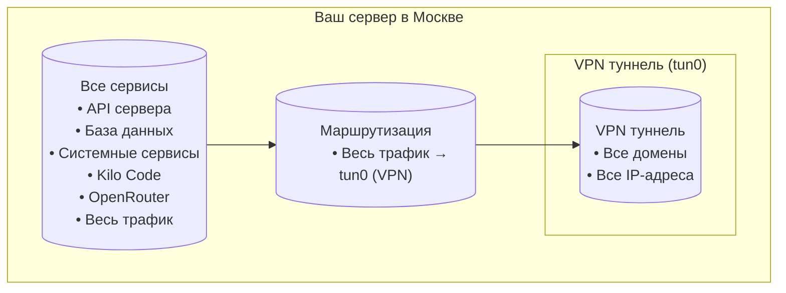

# Сетевая архитектура: Доступ из России

## Проблема

### Географические ограничения
OpenRouter и OpenAI блокируют доступ из российских IP-адресов:
```
OpenRouter: Error code: 403 - {'error': {'message': 'Access denied: This service is not available in your region.'}}
OpenAI: Error code: 403 - {'error': {'code': 'unsupported_country_region_territory', 'message': 'Country, region, or territory not supported'}}
```

### Решение
**Весь трафик идет через VPN** с автоматической сменой DNS.

## Схема конфигурации сети



## Компоненты системы

### 1. AdGuard VPN CLI (Full VPN Mode)
**Режим**: `general` (весь трафик)  
**Опция смены DNS**: `set-change-system-dns on`

**Результат**: 
- Весь трафик идет через VPN
- Системный DNS автоматически меняется на VPN DNS
- Все приложения работают корректно

### 2. systemd-resolved (Базовый DNS)
**Стандартный компонент Ubuntu 22.04**

**Что делает**:
- Слушает порт 53 на `127.0.0.53`
- Пересылает DNS-запросы на upstream DNS
- Кеширует ответы

**Важно**: Не требует дополнительных скриптов или Python форвардеров.

### 3. Автоматическая смена DNS (Ключевой механизм)

#### Как это работает:
1. **Подключение VPN** → `adguardvpn-cli connect -l FRANKFURT`
2. **Опция `set-change-system-dns on`** → автоматически меняет настройки systemd-resolved
3. **systemd-resolved** → начинает использовать VPN DNS (127.0.0.1:46735)
4. **Все приложения** → автоматически используют новый DNS

#### Преимущества:
- ✅ **Автоматизация** — не нужно вручную править конфиги
- ✅ **Надежность** — стандартный механизм Ubuntu
- ✅ **Совместимость** — Docker, Kilo Code, все приложения работают
- ✅ **Простота** — одна команда включает/выключает

## Policy routing для SSH (сохранение доступа)

Уже настроено на вашем сервере:
```bash
ip rule show
# 30754: from 176.123.161.187 lookup 100

ip route show table 100
# default via 176.123.160.1 dev enp3s0 table 100
```

**Что делает**: Весь трафик **от** IP 176.123.161.187 идет через провайдера, минуя VPN. SSH сессии сохраняются даже при включенном VPN.

## Ключевые моменты

### Почему весь трафик через VPN?
- ✅ OpenRouter и OpenAI всегда доступны
- ✅ Нет проблем с маршрутизацией
- ✅ Простая конфигурация

### Почему set-change-system-dns on?
- ✅ Автоматическая смена DNS при подключении VPN
- ✅ Kilo Code и другие приложения работают из коробки
- ✅ Не требует ручного вмешательства
- ✅ Стандартный механизм Ubuntu

## Резюме

**Проблема**: OpenRouter и OpenAI заблокированы в РФ.

**Решение**: 
1. Весь трафик через VPN
2. Автоматическая смена DNS (`set-change-system-dns on`)
3. Policy routing для SSH

**Результат**: 
- ✅ Весь трафик через VPN
- ✅ OpenRouter и OpenAI работают
- ✅ Kilo Code работает
- ✅ SSH всегда доступен
- ✅ Никаких скриптов не нужно

**Автоматизация**: Всё работает из коробки благодаря опциям AdGuard VPN CLI.

## См. также

- [DNS Base Setup](./dns_base.md) - Базовые настройки DNS
- [DNS + VPN Setup](./dns_vpn_setup.md) - Полная рабочая конфигурация
- [AdGuard VPN Setup](./adguard_vpn_setup.md) - Подробная настройка VPN

---

**Дата обновления:** 2025-12-29  
**Статус:** ✅ Обновлено для новой стратегии.