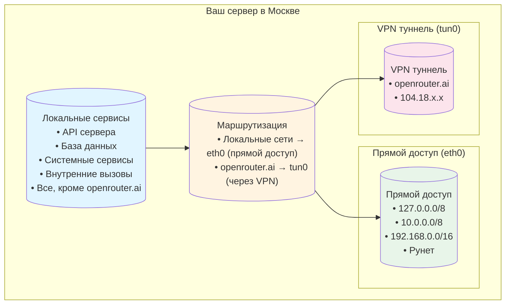

# Сетевая архитектура: Доступ к OpenRouter из России

## Проблема

### Географические ограничения
OpenRouter и OpenAI блокируют доступ из российских IP-адресов:
```
OpenRouter: Error code: 403 - {'error': {'message': 'Access denied: This service is not available in your region.'}}
OpenAI: Error code: 403 - {'error': {'code': 'unsupported_country_region_territory', 'message': 'Country, region, or territory not supported'}}
```

### Дилемма
- **VPN для всего трафика**: ❌ Ломает доступ к локальным сервисам в РФ
- **Без VPN**: ❌ OpenRouter и OpenAI недоступны
- **Решение**: ✅ Селективный VPN (только openrouter.ai и api.openai.com)

## Схема конфигурации сети



## Компоненты системы

### 1. AdGuard VPN CLI (Selective Mode)
**Режим**: `selective`
**Исключения**: `openrouter.ai`, `api.openrouter.ai`, `api.openai.com`

**Результат**: VPN активен только для указанных доменов.

### 2. Скрипт исправления маршрутов
**Файл**: `agent_service/fix-vpn-routes.sh`

**Что делает**:
1. Проверяет подключение VPN через таблицу 880
2. Динамически получает IP-адреса OpenRouter через DNS
3. Удаляет правило `lookup 880` (которое перехватывает ВЕСЬ трафик)
4. Удаляет возможные дубликаты правил
5. Добавляет точечные маршруты только для IP-адресов OpenRouter
6. Восстанавливает маршруты из таблицы `vpn`
7. Проверяет работоспособность и показывает результат

### 3. Маршрутизация

#### До исправления (проблема):
```bash
# Правило перехвата всего трафика
30801: from all lookup 880

# Результат: ВЕСЬ трафик → VPN → ❌ Локальные сервисы недоступны
```

#### После исправления (работает):
```bash
# Точечные маршруты для OpenRouter
104.18.2.115 dev tun0 table vpn
104.18.3.115 dev tun0 table vpn

# Локальные сети → прямой доступ
127.0.0.0/8 dev eth0
10.0.0.0/8 dev eth0
192.168.0.0/16 dev eth0

# Результат: 
# - openrouter.ai → VPN ✅
# - Локальные сервисы → прямой доступ ✅
```

## Ключевые моменты

### Почему selective mode?
- ✅ VPN только для нужных доменов
- ✅ Локальные сервисы работают нормально
- ✅ Остальной интернет без замедления

### Почему нужен скрипт исправления?
- ❌ AdGuard VPN может добавить `lookup 880`
- ✅ Скрипт удаляет это правило
- ✅ Добавляет правильные точечные маршруты
- ✅ Динамически определяет IP-адреса OpenRouter

### Почему systemd/cron?
- ⏰ VPN может переподключаться
- 🔄 Автоматическое исправление
- 🛡️ Стабильная работа

## Резюме

**Проблема**: OpenRouter заблокирован в РФ, но полный VPN ломает локальные сервисы.

**Решение**: Селективный VPN + автоматическое исправление маршрутов.

**Результат**: OpenRouter работает через VPN, локальные сервисы — напрямую.

**Автоматизация**: Systemd timer или cron job для стабильной работы.

## См. также

- [Настройка AdGuard VPN CLI](./adguard_vpn_setup.md) - Подробная настройка VPN
- [Исправление маршрутов](./open_router_vpn.md) - Скрипт и systemd
- [Сетевое взаимодействие](./network_interaction.md) - Общая сетевая архитектура