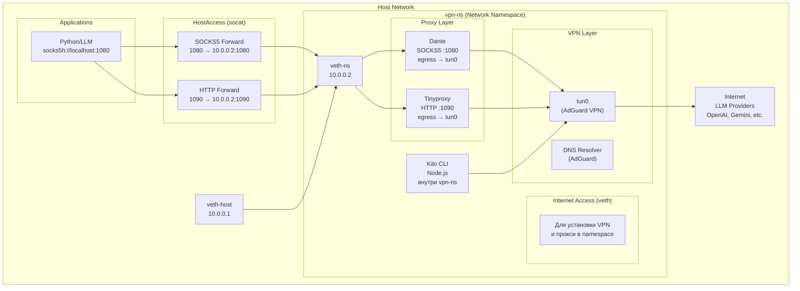

# Архитектура: VPN + Host-Proxy для LLM-запросов

## Короткое описание / Цель архитектуры

Цель — гарантировать, что все вызовы LLM (OpenAI, Gemini, OpenRouter и т.д.) из вашей сети идут через VPN, но при этом:

* не трогать глобальные таблицы маршрутизации Docker-контейнеров/хоста
* не поддерживать списки IP провайдеров
* не маркировать пакеты ipset/fwmark для veth-ns
* минимально менять приложение: только те python-модули, которые делают LLM-вызовы, будут направлять трафик через прокси;
* Kilo (Node.js) запускается непосредственно в `vpn-ns` и всегда использует VPN;
* Python-приложения направляют LLM-вызовы на локальные прокси (SOCKS5 и HTTP), которые живут в `vpn-ns` и делают egress через `tun0`.

Это учебный, простой и воспроизводимый подход: централизованные прокси + VPN namespace с разделением трафика.

---

## Архитектура сети



## Пояснение

* **veth-ns/veth-host** — создается для доступа namespace в интернет (установка VPN, прокси, пакетов)
* **socat** — пробрасывает порты 1080 и 1090 из host в namespace для работы приложений
* **Dante** — SOCKS5 прокси для Python/LLM приложений
* **Tinyproxy** — HTTP прокси для Python/LLM приложений
* **Kilo CLI** (Node.js) — запускается внутри `vpn-ns`, весь его трафик идёт через VPN автоматически
* **Python-приложения** — делают LLM-вызовы на локальные прокси (SOCKS5 и HTTP), которые живут в `vpn-ns` и делают egress через `tun0`

---

## Компоненты и их роли

### vpn-ns (network namespace) — отдельное сетевое пространство, внутри которого находятся:

* `tun0` — VPN-интерфейс, поднятый `adguardvpn-cli`.
* `adguardvpn-cli` — управляет соединением и DNS (resolver) внутри namespace.
* `Dante` — SOCKS5 прокси, слушает порт 1080, делает egress через `tun0`.
* `Tinyproxy` — HTTP прокси, слушает порт 1090, делает egress через `tun0`.
* `Kilo CLI` (Node.js) — запускается внутри `vpn-ns`, весь его трафик идёт через VPN автоматически.
* `veth-ns` — veth-интерфейс (10.0.0.2) для связи с host.

### Host namespace (host):

* `veth-host` — veth-интерфейс (10.0.0.1) для связи с vpn-ns.
* `socat` — пробрасывает порты 1080 и 1090 из host в namespace для работы приложений.

### Интернет / LLM провайдеры — OpenAI, Gemini, OpenRouter и т.д. — все LLM-запросы проходят через VPN, когда они идут через прокси или когда их генерирует Kilo внутри `vpn-ns`.

---

## Разделение прокси

* **Порт 1080 (SOCKS5)**: Python-приложения, Kilo CLI, LLM-вызовы
* **Порт 1090 (HTTP)**: Python-приложения, LLM-вызовы

---

## Почему так сделано (преимущества)

* **Минимальные изменения в приложениях**: менять нужно только те модули, которые делают LLM-вызовы — направлять их на локальный proxy. Остальной код остаётся без изменений.
* **Нет политики маркировки пакетов/сложного routing**: не нужно поддерживать ipset/синхронизацию CIDR-ов LLM провайдеров.
* **DNS под контролем**: `adguardvpn-cli` обеспечивает DNS внутри vpn-namespace, поэтому proxy резолвит имена через adguard (сокращая риск утечек).
* **Чёткая граница**: Kilo — в VPN (все его соединения защищены), другие сервисы — прицельно отправляют LLM-трафик через прокси.
* **Простота**: легко поднять, отладить и протестировать в учебном проекте.
* **Разделение прокси**: SOCKS5 (порт 1080) для Python/LLM приложений и HTTP (порт 1090) для Python/LLM приложений позволяет оптимизировать настройки под каждый тип приложения.

---

## DNS: как предотвратить утечки

* `adguardvpn-cli` запускается в `vpn-ns` и поднимает DNS resolver в этом namespace. Proxy делает DNS-резолв через adguard.
* **SOCKS5 (Dante)**: используйте `socks5h://` — тогда DNS-резолв выполняется на стороне прокси внутри VPN.
* **HTTP (Tinyproxy)**: VS Code использует CONNECT — Tinyproxy резолвит DNS внутри VPN.
* **Kilo CLI**: работает внутри `vpn-ns`, DNS идёт через adguardvpn-cli.

---

## Proxy: рекомендации по выбору и настройке

### Два прокси для разных задач:

**SOCKS5 (Dante) — порт 1080:**
* **Тип**: SOCKS5 с поддержкой `socks5h` (резолв у прокси).
* **Требования**:
  * Поддержка streaming / long-lived connections (для LLM streaming).
  * Не буферизировать ответы (чтобы streaming работал корректно).
  * Не делать MITM TLS.
* **Использование**: Python-приложения, Kilo CLI, LLM-вызовы.

**HTTP (Tinyproxy) — порт 1090:**
* **Тип**: HTTP proxy с поддержкой CONNECT.
* **Требования**:
  * Поддержка HTTPS через CONNECT.
  * Не буферизировать ответы.
  * Не делать MITM TLS.
* **Использование**: Python-приложения, LLM-вызовы.

### HostAccess: варианты доступа из host → vpn-ns

**Текущая реализация — Port forwarding (проброс портов):**

1. **SOCKS5 (порт 1080)**: host:1080 → vpn-ns:1080 (Dante)
   * Простой способ в учебном окружении.
   * Python-приложения используют `socks5h://localhost:1080`.
   * Внутренний трафик к прокси идёт через `HostAccess` (порт 1080 проброшен).

2. **HTTP (порт 1090)**: host:1090 → vpn-ns:1090 (Tinyproxy)
   * VS Code Server использует `http://localhost:1090`.
   * Для HTTPS VS Code использует CONNECT — Tinyproxy делает резолв внутри VPN.
   * Внутренний трафик к прокси идёт через `HostAccess` (порт 1090 проброшен).

**Важно**: veth-интерфейсы (`veth-host` и `veth-ns`) используются **только для первоначального доступа в интернет** внутри namespace (чтобы установить VPN и прокси, пакетов). Проброс портов для приложений идёт через `socat` отдельно.

**Альтернатива — veth pair + host-side IP:**
* Создать veth-пару (10.0.0.1/10.0.0.2), пробросить трафик.
* Более «чистый» сетевой вариант, чуть сложнее при настройке.
* Для быстрого запуска используется проброс портов через `socat`.

---

## Интеграция в код (минимальные шаблоны)

### Python — пример `llm_client` (sync/async)

`requests` (sync):
```python
import requests

def get_llm_session():
    s = requests.Session()
    s.proxies.update({
        "http": "socks5h://localhost:1080",
        "https": "socks5h://localhost:1080",
    })
    return s

def call_llm(payload):
    s = get_llm_session()
    r = s.post("https://api.openai.com/v1/...", json=payload, headers={"Authorization":"Bearer ..."})
    return r.json()
```

`httpx` (async):
```python
import httpx

async def call_llm_async(payload):
    async with httpx.AsyncClient(proxies="socks5h://localhost:1080") as client:
        r = await client.post("https://api.openai.com/v1/...", json=payload, headers={"Authorization":"Bearer ..."})
        return r.json()
```

**Примечание:**
* `localhost:1080` — SOCKS5 прокси (Dante) для Python/LLM приложений.
* Оба прокси делают egress через `tun0` → VPN.

---

## Короткий чек-лист для запуска (без команд, только порядок действий)

1. Поднять `vpn-ns` и `adguardvpn-cli` → `tun0` + DNS (внутри vpn-ns).
2. Запустить `Dante` (SOCKS5, порт 1080) внутри `vpn-ns`.
3. Запустить `Tinyproxy` (HTTP, порт 1090) внутри `vpn-ns`.
4. Проверить, что оба прокси делают egress через `tun0`.
5. Организовать `HostAccess` через `socat`:
   * Проброс порта 1080 → vpn-ns:1080 (SOCKS5).
   * Проброс порта 1090 → vpn-ns:1090 (HTTP).
6. Запустить `Kilo` внутри `vpn-ns`.
7. В Python-приложениях: использовать `socks5h://localhost:1080` для LLM-вызовов.
8. Включить health-check/alerting на proxy/VPN.

---

## Дополнительная информация

### Система
* **OS**: Linux 5.15
* **Cgroups**: cgroup2
* **Podman**: версия неизвестна

### VPN конфигурация
* **Namespace**: vpn-ns
* **VPN интерфейс**: tun0 с IP 172.16.219.2/32
* **Veth интерфейс**: veth-ns с IP 10.0.0.2/24
* **Хост интерфейс**: enp3s0 с IP 176.123.161.187

### Компоненты
* **Kilo CLI** (Node.js) — запускается внутри `vpn-ns`, весь его трафик идёт через VPN
* **Python/LLM приложения** — делают LLM-вызовы на локальные прокси (SOCKS5 и HTTP), которые живут в `vpn-ns` и делают egress через `tun0`

---

## Ссылки на важные файлы

1. [`TASK_CONTEXT.md`](TASK_CONTEXT.md) - Основной контекст задачи
2. [`docs/vs_code_podman.md`](docs/vs_code_podman.md) - Документация по VPN и Podman
3. [`docs/ai_consultation_dns_result.md`](docs/ai_consultation_dns_result.md) - Консультация от ИИ
4. [`docs/dns_solutions_analysis.md`](docs/dns_solutions_analysis.md) - Анализ DNS решений от ИИ
5. [`docs/dns_solutions_context7_analysis.md`](docs/dns_solutions_context7_analysis.md) - Анализ DNS решений с документацией Context7
6. [`docs/dns_testing_results.md`](docs/dns_testing_results.md) - Результаты тестирования DNS решений
7. [`unbound.conf`](unbound.conf) - Конфигурация unbound
