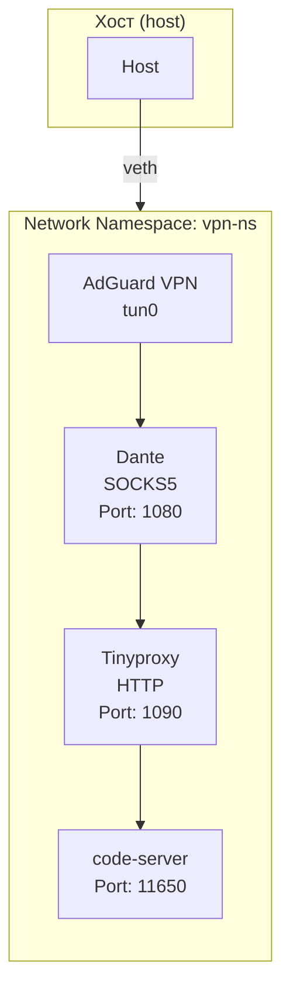

# VS Code Server в Network Namespace с VPN

## Обзор

Этот документ описывает как запускать VS Code Server (code-server) в изолированном network namespace `vpn-ns` с доступом к VPN.

## Архитектура



## Компоненты

### 1. Network Namespace: vpn-ns
Изолированное сетевое пространство, где запускается VPN и приложения.

### 2. AdGuard VPN (tun0)
VPN клиент, который создаёт туннельный интерфейс `tun0` внутри namespace.

### 3. Dante (SOCKS5 Proxy)
SOCKS5 прокси сервер на порту **1080** для Python-приложений и Kilo CLI.

### 4. Tinyproxy (HTTP Proxy)
HTTP прокси сервер на порту **1090** для VS Code Server и его расширений.

### 5. code-server
VS Code Server, который запускается на порту **11650** и использует HTTP прокси.

### 6. Host Port Forwarding
Проброс порта **11650** с хоста на namespace для доступа к code-server.

## Скрипты

### Основной скрипт: `run-vscode-in-vpn-ns-safe.sh`
Безопасная версия скрипта для запуска code-server в namespace с VPN.

**Особенности:**
- Автоматическая очистка при выходе (Ctrl-C)
- Бэкап текущих правил iptables перед изменениями
- Безопасная настройка MASQUERADE (внутри namespace через tun0)
- Автоматическое определение хоста для прокси
- Автоматическая настройка FORWARD правил для разрешения трафика между хостом и namespace

**Использование:**
```bash
sudo ./vpn-utils/scripts/run-vscode-in-vpn-ns-safe.sh
```

**Переменные окружения:**
```bash
CODESERVER_PORT=11650 sudo ./vpn-utils/scripts/run-vscode-in-vpn-ns-safe.sh
```

## Запуск

### 1. Проверка prerequisites

Убедитесь, что:
- Network namespace `vpn-ns` существует
- AdGuard VPN подключён (интерфейс `tun0` в namespace)
- code-server установлен

### 2. Запуск в tmux (рекомендуется)

```bash
# Создаем tmux сессию
tmux new-session -d -s vscode-vpn

# Запускаем скрипт
tmux send-keys -t vscode-vpn "sudo ./vpn-utils/scripts/run-vscode-in-vpn-ns-safe.sh" C-m

# Подключаемся к сессии для мониторинга
tmux attach -t vscode-vpn
```

**Примечание:** Запуск в tmux обязателен для предотвращения потери связи при выходе из терминала.

### 3. Прямой запуск

```bash
sudo ./vpn-utils/scripts/run-vscode-in-vpn-ns-safe.sh
```

## Доступ к VS Code Server

После успешного запуска:

1. Откройте браузер: `http://<IP-хоста>:11650`
2. Пароль находится в: `~/.config/code-server/config.yaml`

## Проверка работы

### 1. Проверка VPN

```bash
# Проверка интерфейса tun0 в namespace
sudo ip netns exec vpn-ns ip addr show tun0

# Проверка внешнего IP (должен быть IP VPN)
sudo ip netns exec vpn-ns curl -s ifconfig.me
```

### 2. Проверка прокси

```bash
# Проверка SOCKS5 прокси (порт 1080)
curl -v -x socks5h://localhost:1080 https://ifconfig.me

# Проверка HTTP прокси (порт 1090)
curl -v -x http://localhost:1090 https://ifconfig.me
```

### 3. Проверка code-server

```bash
# Проверка, что code-server слушает на порту 11650
sudo ip netns exec vpn-ns ss -tlnp | grep 11650

# Проверка доступа к code-server
curl -I http://localhost:11650
```

### 4. Проверка правил iptables

```bash
# Проверка правил PREROUTING (DNAT)
sudo iptables -t nat -L PREROUTING --line-numbers -n

# Проверка правил POSTROUTING (MASQUERADE)
sudo iptables -t nat -L POSTROUTING --line-numbers -n

# Проверка правил FORWARD
sudo iptables -L FORWARD --line-numbers -n

# Проверка правил внутри namespace
sudo ip netns exec vpn-ns iptables -t nat -L POSTROUTING --line-numbers -n 2>/dev/null || true
```

## Тестирование с Gemini API

### 1. Запуск теста в code-server

1. Откройте code-server в браузере: `http://<IP-хоста>:11650`
2. Создайте новый файл: `test-gemini.js`
3. Вставьте следующий код:

```javascript
// Тест доступа к Gemini API через VS Code
const https = require('https');

// Тестовый запрос к Gemini API
const testGeminiAPI = async () => {
    try {
        const response = await https.get('https://generativelanguage.googleapis.com/v1beta/models', {
            headers: {
                'Authorization': 'Bearer <YOUR_API_KEY>'
            }
        });
        
        console.log('✓ Gemini API доступен через VPN!');
        console.log('Статус:', response.statusCode);
        console.log('Данные:', JSON.stringify(response.data, null, 2));
    } catch (error) {
        console.error('✗ Ошибка доступа к Gemini API:', error.message);
    }
};

testGeminiAPI();
```

4. Замените `<YOUR_API_KEY>` на ваш API ключ
5. Запустите файл в терминале code-server

### 2. Проверка IP адреса

В терминале code-server:
```bash
# Проверка внешнего IP (должен быть IP VPN)
curl -s ifconfig.me

# Проверка IP через прокси
curl -x http://127.0.0.1:1090 -s ifconfig.me
```

## Устранение неполадок

### Проблема: Связь потеряна после запуска скрипта

**Решение:** Используйте безопасную версию скрипта `run-vscode-in-vpn-ns-safe.sh`, которая:
- Делает бэкап правил iptables перед изменениями
- Автоматически очищает правила при выходе (Ctrl-C)
- Безопасно настраивает MASQUERADE
- Настраивает FORWARD правила для разрешения трафика между хостом и namespace

Если связь всё же потерялась, нажмите Ctrl-C для автоматического отката изменений.

### Проблема: code-server не запускается

**Решение:**
1. Проверьте, что namespace существует:
   ```bash
   sudo ip netns list
   ```

2. Проверьте, что VPN подключён:
   ```bash
   sudo ip netns exec vpn-ns ip addr show tun0
   ```

3. Проверьте логи code-server:
   ```bash
   tail -f ~/.local/share/code-server/logs/code-server.log
   ```

### Проблема: Расширения VS Code не работают

**Решение:**
1. Проверьте, что HTTP прокси настроен в VS Code:
   - Откройте Settings (Ctrl+,)
   - Перейдите в Proxy Settings
   - Убедитесь, что HTTP Proxy установлен на `http://127.0.0.1:1090`

2. Перезапустите VS Code Server:
   ```bash
   # Остановите текущий процесс
   pkill -f code-server
   
   # Запустите снова
   sudo ./vpn-utils/scripts/run-vscode-in-vpn-ns-safe.sh
   ```

### Проблема: Невозможно подключиться к code-server

**Решение:**
1. Проверьте, что порт 11650 не занят:
   ```bash
   ss -tlnp | grep 11650
   ```

2. Проверьте правила iptables:
   ```bash
   sudo iptables -t nat -L PREROUTING --line-numbers -n
   ```

3. Проверьте, что code-server запущен:
   ```bash
   ps aux | grep code-server
   ```

## Примечания

1. **Безопасность:** Скрипт `run-vscode-in-vpn-ns-safe.sh` автоматически делает бэкап правил iptables и очищает их при выходе (Ctrl-C).

2. **Proxy настройки:** code-server использует HTTP прокси на порту 1090. Убедитесь, что tinyproxy запущен.

3. **Порты:**
   - 1080: SOCKS5 прокси (Dante)
   - 1090: HTTP прокси (Tinyproxy)
   - 11650: code-server (свободный порт)

4. **Persistent:** Для постоянной работы настройте `systemd` unit или используйте `tmux`/`screen`.

5. **Backup:** Скрипт автоматически сохраняет бэкап правил iptables в `/tmp/iptables-backups-<дата>/`.

6. **FORWARD правила:** Скрипт автоматически настраивает правила FORWARD для разрешения трафика между хостом и namespace (подсеть 10.200.1.0/24). Это необходимо, если политика FORWARD установлена в DROP (например, из-за ufw или Docker).

## Дополнительные ресурсы

- [runbook_vpn_setup.md](./runbook_vpn_setup.md) - Полная документация по настройке VPN и прокси
- [gpt5_advice.md](./gpt5_advice.md) - Советы по безопасной настройке от GPT5
- [gpt5_advice2.md](./gpt5_advice2.md) - Решение проблемы с FORWARD правилами
- [vs_code_remote_ssh.md](./vs_code_remote_ssh.md) - Документация по VS Code Remote SSH

## Контрольный чек-лист

- [x] Network namespace `vpn-ns` существует
- [x] AdGuard VPN подключён (интерфейс `tun0` в namespace)
- [x] Dante прокси запущен на порту 1080
- [x] Tinyproxy запущен на порту 1090
- [x] code-server установлен
- [x] code-server запущен в namespace на порту 11650
- [x] Проброс порта 11650 настроен
- [x] Доступ к code-server через браузер работает
- [x] HTTP прокси настроен в VS Code
- [x] Расширения VS Code могут делать запросы через прокси
- [x] Доступ к Gemini API через VPN работает

