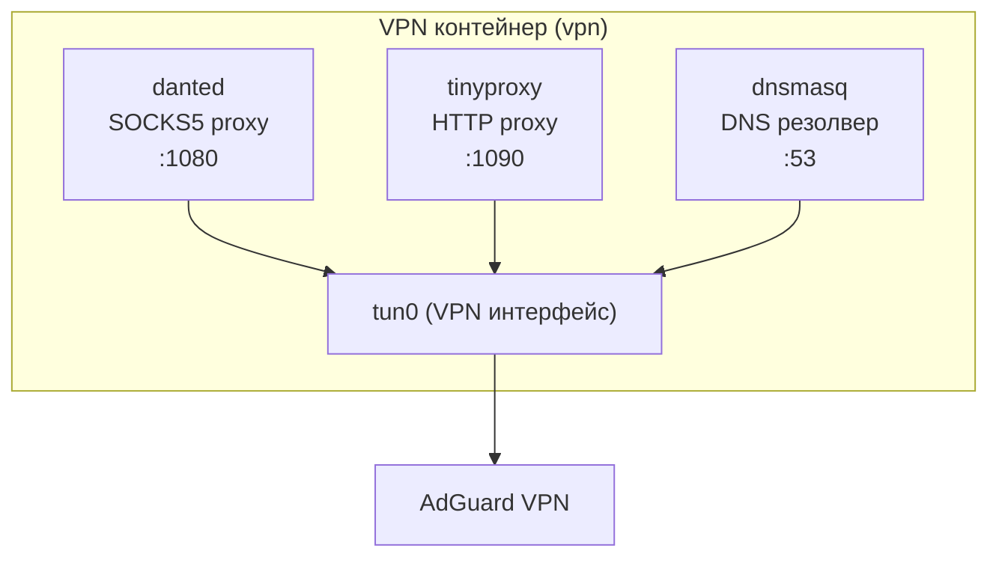
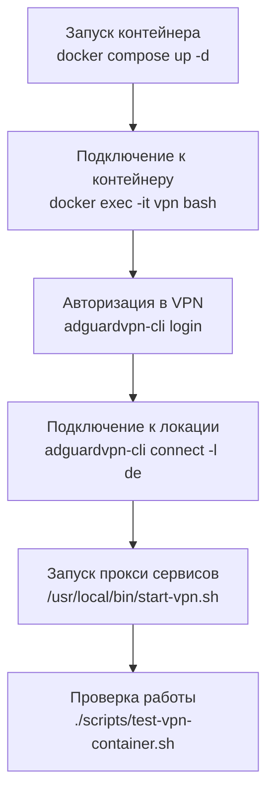

# VPN контейнер

Контейнер для работы с AdGuard VPN и прокси серверами (SOCKS5 и HTTP).

## Архитектура



## Порты

| Порт | Протокол | Описание |
|------|-----------|----------|
| 1080 | SOCKS5 | SOCKS5 proxy (danted) |
| 1090 | HTTP | HTTP proxy (tinyproxy) |

## Быстрый старт

### 1. Сборка образа

```bash
cd vpn
docker compose build
```

### 2. Запуск контейнера

```bash
docker compose up -d
```

### 3. Подключение к контейнеру

```bash
docker exec -it vpn bash
```

### 4. Авторизация в AdGuard VPN

```bash
adguardvpn-cli login
```

Откройте ссылку в браузере для авторизации.

### 5. Просмотр доступных локаций

```bash
adguardvpn-cli list-locations
```

### 6. Подключение к VPN

```bash
# Подключение к конкретной локации
adguardvpn-cli connect -l de

# Или к любой доступной
adguardvpn-cli connect
```

### 7. Запуск прокси сервисов

```bash
/usr/local/bin/start-vpn.sh
```

Этот скрипт:
- Проверяет наличие интерфейса `tun0`
- Запускает dnsmasq (DNS резолвер)
- Запускает danted (SOCKS5 proxy на порту 1080)
- Запускает tinyproxy (HTTP proxy на порту 1090)

### 8. Проверка статуса VPN

```bash
adguardvpn-cli status
```

### 9. Проверка IP через VPN

```bash
curl https://api.ipify.org
```

## Workflow работы с контейнером



## Команды управления

### Перезапуск прокси сервисов

```bash
/usr/local/bin/start-vpn.sh
```

### Просмотр логов

```bash
# Логи danted (SOCKS5)
tail -f /var/log/danted.log

# Логи tinyproxy (HTTP)
tail -f /var/log/tinyproxy/tinyproxy.log

# Логи dnsmasq
tail -f /var/log/dnsmasq.log
```

### Проверка запущенных процессов

```bash
ps aux | grep -E "danted|tinyproxy|dnsmasq"
```

### Отключение от VPN

```bash
adguardvpn-cli disconnect
```

### Выход из контейнера

```bash
exit
```

## Использование прокси

### SOCKS5 proxy (порт 1080)

```bash
# Использование с curl
curl --socks5 127.0.0.1:1080 https://api.ipify.org

# Использование с proxychains
echo "socks5 127.0.0.1 1080" >> /etc/proxychains.conf
proxychains curl https://api.ipify.org
```

### HTTP proxy (порт 1090)

```bash
# Использование с curl
curl --proxy http://127.0.0.1:1090 https://api.ipify.org

# Использование с переменными окружения
export HTTP_PROXY=http://127.0.0.1:1090
export HTTPS_PROXY=http://127.0.0.1:1090
curl https://api.ipify.org
```

## Подключение из других контейнеров

### Dev контейнер (network_mode: container:vpn)

```yaml
services:
  dev:
    container_name: dev
    network_mode: "container:vpn"
    environment:
      - HTTP_PROXY=http://127.0.0.1:1090
      - HTTPS_PROXY=http://127.0.0.1:1090
```

### App контейнеры (через docker-сеть)

```yaml
services:
  app:
    container_name: app
    networks:
      - vpn-net
    environment:
      - ALL_PROXY=socks5h://vpn:1080
      - HTTP_PROXY=http://vpn:1090
      - HTTPS_PROXY=http://vpn:1090

networks:
  vpn-net:
    external: true
```

## Конфигурационные файлы

### danted.conf (SOCKS5 proxy)

- Путь: `/etc/danted.conf`
- Логи: `/var/log/danted.log`
- Порт: 1080
- External интерфейс: `tun0`

### tinyproxy.conf (HTTP proxy)

- Путь: `/etc/tinyproxy/tinyproxy.conf`
- Логи: `/var/log/tinyproxy/tinyproxy.log`
- Порт: 1090

### dnsmasq.conf (DNS резолвер)

- Путь: `/etc/dnsmasq.conf`
- DNS серверы: 94.140.14.14, 94.140.15.15 (AdGuard DNS)

## Устранение проблем

### Интерфейс tun0 не найден

**Проблема:** Скрипт `start-vpn.sh` сообщает, что `tun0` не найден.

**Решение:**
```bash
# Проверьте статус VPN
adguardvpn-cli status

# Если не подключен, подключитесь
adguardvpn-cli connect -l <location>
```

### Прокси сервисы не запускаются

**Проблема:** danted или tinyproxy не запускаются.

**Решение:**
```bash
# Проверьте конфигурационные файлы
cat /etc/danted.conf
cat /etc/tinyproxy/tinyproxy.conf

# Проверьте логи
tail -f /var/log/danted.log
tail -f /var/log/tinyproxy/tinyproxy.log

# Перезапустите скрипт
/usr/local/bin/start-vpn.sh
```

### Прокси не работает из других контейнеров

**Проблема:** Контейнеры не могут подключиться к прокси.

**Решение:**
```bash
# Проверьте, что контейнер vpn запущен
docker ps | grep vpn

# Проверьте, что контейнеры в одной сети
docker network inspect vpn-net

# Проверьте, что прокси сервисы запущены
docker exec vpn ps aux | grep -E "danted|tinyproxy"
```

## Структура файлов

```
vpn/
├── Dockerfile              # Образ контейнера
├── docker-compose.yml      # Конфигурация docker-compose
├── entrypoint.sh          # Скрипт запуска контейнера
├── start-vpn.sh          # Скрипт запуска прокси сервисов
├── danted.conf           # Конфигурация SOCKS5 proxy
├── tinyproxy.conf        # Конфигурация HTTP proxy
├── dnsmasq.conf         # Конфигурация DNS резолвера
└── README.md            # Этот файл
```

## Примечания

- Контейнер требует `NET_ADMIN` capability и доступ к `/dev/net/tun`
- Прокси порты не пробрасываются на хост, доступны только внутри docker-сети
- После перезапуска контейнера необходимо заново подключиться к VPN и запустить `start-vpn.sh`
- Для автоматического запуска при старте контейнера можно использовать `ADGUARDVPN_TOKEN` переменную окружения (требует настройки)
